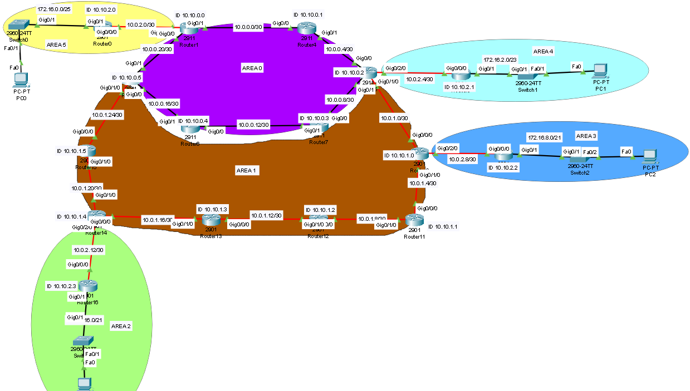

# RED OSPF


[Descargar topología de red](practicas/topologia_red.pkt)

# configuracion 
## ROUTER CORE 1
```conf
ENA
CONF T
NO LOGGING CONSOLE
NO IP DOMAIN LOOKUP
HOSTNAME ROC1
INT G 0/1 
IP ADD 10.0.0.1 255.255.255.252
NO SHUT
EXIT
	
INT G 0/0
IP ADD 10.0.0.22 255.255.255.252
NO SHUT
EXIT

INT G 0/2/0
IP ADD 10.0.2.2 255.255.255.252
NO SHUT
EXIT


INT LOOPBACK0
IP ADD 10.10.0.0 255.255.255.255
NO SHUT
EXIT
	
ROUTER OSPF 1
NETWORK 10.10.0.0 0.0.0.0 AREA 0
NETWORK 10.0.0.0 0.0.0.3 AREA 0
NETWORK 10.0.0.20 0.0.0.3 AREA 0
NETWORK 10.0.2.0 0.0.0.3 AREA 5
EXIT
```
### ROUTER CORE 2
```conf
ENA
CONF T
NO LOGGING CONSOLE
NO IP DOMAIN LOOKUP
HOSTNAME ROC2
INT G 0/0
IP ADD 10.0.0.2 255.255.255.252
NO SHUT
EXIT

INT G 0/1
IP ADD 10.0.0.5 255.255.255.252
NO SHUT
EXIT

INT LOOPBACK0
IP ADD 10.10.0.1 255.255.255.255
NO SHUT
EXIT

ROUTER OSPF 1 
NETWORK 10.10.0.1 0.0.0.0 AREA 0
NETWORK 10.0.0.0 0.0.0.3 AREA 0
NETWORK 10.0.0.4 0.0.0.3 AREA 0
EXIT
```
### ROUTER ABR CORE 3 

```conf
ENA
CONF T
NO LOGGING CONSOLE 
NO IP DOMAIN LOOKUP
HOSTNAME ROC3
INT G 0/0
IP ADD 10.0.0.6 255.255.255.252
NO SHUT
EXIT

INT G 0/1
IP ADD 10.0.0.9 255.255.255.252
NO SHUT
EXIT

INT G 0/2/0
RIP ADD 10.0.2.5 255.255.255.252
NO SHUT
EXIT

INT G 0/1/0
IP ADD 10.0.1.1 255.255.255.252
NO SHUT
EXIT

INT LOOPBACK0
IP ADD 10.10.0.2 255.255.255.255
NO SHUT
EXIT

ROUTER OSPF 1
NETWORK 10.10.0.2 0.0.0.0 AREA 0
NETWORK 10.0.0.4 0.0.0.3 AREA 0
NETWORK 10.0.0.8 0.0.0.3 AREA 0
NETWORK 10.0.2.4 0.0.0.3 AREA 4
NETWORK 10.0.1.0 0.0.0.3 AREA 1
EXIT
```
### ROUTER CORE 4
```conf
ENA
CONF T
NO LOGGING CONSOLE
NO IP DOMAIN LOOKUP
HOSTNAME ROC4
INT G 0/1
IP ADD 10.0.0.13 255.255.255.252
NO SHUT
EXIT

INT G 0/0
IP ADD 10.0.0.10 255.255.255.252
NO SHUT
EXIT

INT LOOPBACK0
IP ADD 10.10.0.3 255.255.255.255
NO SHUT
EXIT

ROUTER OSPF 1
NETWORK 10.10.0.3 0.0.0.0 AREA 0
NETWORK 10.0.0.8 0.0.0.3 AREA 0
NETWORK 10.0.0.12 0.0.0.3 AREA 0
```
### ROUTER CORE 5

```conf
ENA
CONF T
NO LOGGING CONSOLE
NO IP DOMAIN LOOKUP
HOSTNAME ROC5
INT G 0/0
IP ADD 10.0.0.14 255.255.255.252
NO SHUT
EXIT

INT G 0/1
IP ADD 10.0.0.17 255.255.255.252
NO SHUT
EXIT

INT LOOPBACK0
IP ADD 10.10.0.4 255.255.255.255
NO SHUT
EXIT

ROUTER OSPF 1
NETWORK 10.10.0.4 0.0.0.0 AREA 0
NETWORK 10.0.0.12 0.0.0.3 AREA 0
NETWORK 10.0.0.16 0.0.0.3 AREA 0
```
### ROUTER ABR CORE 6

```conf
ENA
CONF T
NO LOGGING CONSOLE
NO IP DOMAIN LOOKUP
HOSTNAME ROC6
INT G 0/0
IP ADD 10.0.0.18 255.255.255.252
NO SHUT
EXIT

INT G 0/1
IP ADD 10.0.0.21 255.255.255.252
NO SHUT
EXIT

INT G 0/1/0
IP ADD 10.0.1.26 255.255.255.252
NO SHUT
EXIT

INT LOOPBACK0
IP ADD 10.10.0.5 255.255.255.255
NO SHUT
EXIT

ROUTER OSPF 1
NETWORK 10.10.0.5 0.0.0.0 AREA 0
NETWORK 10.0.0.16 0.0.0.3 AREA 0
NETWORK 10.0.0.20 0.0.0.3 AREA 0
NETWORK 10.0.1.24 0.0.0.3 AREA 1
EXIT
```
### ROUTER DISTRIBUTION 1
```conf
ENA
CONF T

NO LOGGING CONSOLE
NO IP DOMAIN LOOKUP
HOSTNAME ROD1
#INT G 0/0/0 
IP ADD 10.0.1.2 255.255.255.252
NO SHUT
EXIT

INT G 0/1/0
IP ADD 10.0.1.5 255.255.255.252
NO SHUT
EXIT

INT G 0/2/0 
IP ADD 10.0.2.9 255.255.255.252
NO SHUT
EXIT

INT LOOPBACK0
IP ADD 10.10.1.0 255.255.255.255
NO SHUT
EXIT

ROUTER OSPF 1
NETWORK 10.10.1.0 0.0.0.0 AREA 1
NETWORK 10.0.1.0 0.0.0.3 AREA 1
NETWORK 10.0.1.4 0.0.0.3 AREA 1
NETWORK 10.0.2.8 0.0.0.3 AREA 3
EXIT
```
### ROUTER DISTRIBUTION 2
```conf
ENA
CONF T
NO LOGGING CONSOLE
NO IP DOMAIN LOOKUP
HOSTNAME ROD2
INT G 0/0/0
IP ADD 10.0.1.6 255.255.255.252
NO SHUT
EXIT

INT G 0/1/0
IP ADD 10.0.1.9 255.255.255.252
NO SHUT
EXIT

INT LOOPBACK0
IP ADD 10.10.1.1 255.255.255.255
NO SHUT
EXIT

ROUTER OSPF 1
NETWORK 10.10.1.1 0.0.0.0 AREA 1
NETWORK 10.0.1.4 0.0.0.3 AREA 1
NETWORK 10.0.1.8 0.0.0.3 AREA 1
EXIT
```
### ROUTER DISTRIBUTION 3
```conf
ENA
CONF T
NO LOGGING CONSOLE
NO IP DOMAIN LOOKUP
HOSTNAME ROD3
INT G 0/0/0
IP ADD 10.0.1.10 255.255.255.252
NO SHUT
EXIT

INT G 0/1/0
IP ADD 10.0.1.13 255.255.255.252
NO SHUT
EXIT

INT LOOPBACK0
IP ADD 10.10.1.2 255.255.255.255
NO SHUT
EXIT

ROUTER OSPF 1
NETWORK 10.10.1.2 0.0.0.0 AREA 1
NETWORK 10.0.1.8 0.0.0.3 AREA 1
NETWORK 10.0.1.12 0.0.0.3 AREA 1
EXIT
```
### ROUTER DISTRIBUTION 4
```conf
ENA
CONF T
NO LOGGING CONSOLE
NO IP DOMAIN LOOKUP
HOSTNAME ROC4
INT G 0/0/0
IP ADD 10.0.1.14 255.255.255.252
NO SHUT
EXIT

INT G 0/1/0
IP ADD 10.0.1.17 255.255.255.252
NO SHUT
EXIT

INT LOOPBACK0
IP ADD 10.10.1.3 255.255.255.255
NO SHUT
EXIT

ROUTER OSPF 1
NETWORK 10.10.1.3 0.0.0.0 AREA 1
NETWORK 10.0.1.12 0.0.0.3 AREA 1
NETWORK 10.0.1.16 0.0.0.3 AREA 1
EXIT
```
### ROUTER ABR DISTRUBITION 5
```conf
ENA
CONF T
NO LOGGING CONSOLE 
NO IP DOMAIN LOOKUP
HOSTNAME ROD5
INT G 0/0/0
IP ADD 10.0.1.18 255.255.255.252
NO SHUT
EXIT

INT G 0/1/0
IP ADD 10.0.1.22 255.255.255.252
NO SHUT
EXIT

INT G 0/2/0
IP ADD 10.0.2.13 255.255.255.252
NO SHUT
EXIT

INT LOOPBACK0
IP ADD 10.10.1.4 255.255.255.255
NO SHUT
EXIT

ROUTER OSPF 1
NETWORK 10.10.1.4 0.0.0.0 AREA 1
NETWORK 10.0.1.16 0.0.0.3 AREA 1
NETWORK 10.0.1.20 0.0.0.3 AREA 1
NETWORK 10.0.2.12 0.0.0.3 AREA 2
EXIT
```
### ROUTER DISTRUBITION 6

```conf
ENA
CONF T
NO LOGGING CONSOLE 
NO IP DOMAIN LOOKUP
HOSTNAME ROD6
INT G 0/1/0
IP ADD 10.0.1.21 255.255.255.252
NO SHUT
EXIT

INT G 0/0/0
IP ADD 10.0.1.25 255.255.255.252
NO SHUT
EXIT

INT LOOPBACK0
IP ADD 10.10.1.5 255.255.255.255
NO SHUT
EXIT

ROUTER OSPF 1
NETWORK 10.10.1.5 0.0.0.0 AREA 1
NETWORK 10.0.1.20 0.0.0.3 AREA 1
NETWORK 10.0.1.24 0.0.0.3 AREA 1
EXIT
```
### ROUTER ACCESS 1
```conf
ENA
CONF T

NO LOGGING CONSOLE 
NO IP DOMAIN LOOKUP
HOSTNAME ROA1
INT G 0/0/0
IP ADD 10.0.2.1 255.255.255.252
NO SHUT

EXIT
INT G 0/1
IP ADD 172.16.0.1 255.255.255.128
NO SHUT
EXIT

INT LOOPBACK0
IP ADD 10.10.2.0 255.255.255.255
NO SHUT
EXIT

ROUTER OSPF 1
NETWORK 10.10.2.0 0.0.0.0 AREA 5
NETWORK 10.0.2.0 0.0.0.3 AREA 5
NETWORK 172.16.0.0 0.0.0.127 AREA 5
EXIT
```
### ROUTER ACCESS 2
```conf
ENA
CONF T
NO LOGGING CONSOLE
NO IP DOMAIN LOOKUP
HOSTNAME ROA2
INT G 0/0/0
IP ADD 10.0.2.6 255.255.255.252
NO SHUT
EXIT

INT G 0/1
IP ADD 172.16.2.1 255.255.254.0
NO SHUT
EXIT

INT LOOPBACK0
IP ADD 10.10.2.1 255.255.255.255
NO SHUT
EXIT

ROUTER OSPF 1
NETWORK 10.10.2.1 0.0.0.0 AREA 4
NETWORK 10.0.2.4 0.0.0.3 AREA 4
NETWORK 172.16.2.0 0.0.1.255 AREA 4
EXIT
```
### ROUTER ACCESS 3
```conf
ENA
CONF T
NO LOGGING CONSOLE 
NO IP DOMAIN LOOKUP
HOSTNAME ROA3
INT G 0/0/0
IP ADD 10.0.2.10 255.255.255.252
NO SHUT
EXIT

INT G 0/1
IP ADD 172.16.8.1 255.255.248.0
NO SHUT
EXIT

INT LOOPBACK0
IP ADD 10.10.2.2 255.255.255.255
NO SHUT
EXIT

ROUTER OSPF 1
NETWORK 10.10.2.2 0.0.0.0 AREA 3
NETWORK 10.0.2.8 0.0.0.3 AREA 3
NETWORK 172.16.8.0 0.0.7.255 AREA 3
EXIT
```
### ROUTER ACCESS 4
```conf
ENA
CONF T
NO LOGGING CONSOLE 
NO IP DOMAIN LOOKUP
HOSTNAME ROA4
INT G 0/0/0
IP ADD 10.0.2.14 255.255.255.252
NO SHUT
EXIT

INT G 0/1
IP ADD 172.16.16.1 255.255.248.0
NO SHUT
EXIT

INT LOOPBACK0
IP ADD 10.10.2.3 255.255.255.255
NO SHUT
EXIT

ROUTER OSPF 1
NETWORK 10.10.2.3 0.0.0.0 AREA 2
NETWORK 10.0.2.12 0.0.0.3 AREA 2
NETWORK 172.16.16.0 0.0.7.255 AREA 2
EXIT
```
### VIRTUAL LINK 1
#### VIRTUAL LINK ROD1 A ROC3

```conf

ENA
CONF T
ROUTER OSPF 1
AREA 1 
AREA 1 Virtual-link 10.10.0.2
EXIT
```
#### VIRTUAL LINK ROC3 A ROD1
```conf

ENA
CONF T
ROUTER OSPF 1
AREA 1 Virtual-link 10.10.1.0
EXIT
```
### VIRTUAL LINK 2
#### VIRTUAL LINK ROD5 A ROD6

```conf
ENA
CONF T
ROUTER OSPF 1
AREA 1 Virtual-link 10.10.0.4
EXIT

```
#### VIRTUAL LINK ROC6 A ROD5
```conf
ENA
CONF T
ROUTER OSPF 1
AREA 1 Virtual-link 10.10.1.4
EXIT
```


